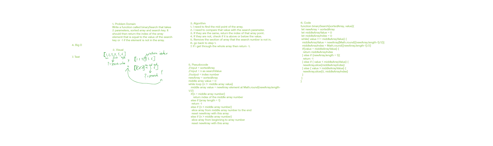

# Binary Search of Sorted Array
Write a function called **BinarySearch** which takes in 2 parameters: a sorted array and the search key. Without utilizing any of the built-in methods available to your language, return the index of the array’s element that is equal to the value of the search key, or -1 if the element is not in the array.

**NOTE**: The search algorithm used in your function should be a binary search.
- Check the Resources section for details

## Whiteboard Process

## Approach & Efficiency
For this whiteboard I did not write as much in the algorith but then refined that thought process in the pseudocode and finally prodiced the finished product of the code. I concidered using a nested if/else statement but decided on one longer linear one as it was more efficient and simpler to understand.

[Return](../README.md)