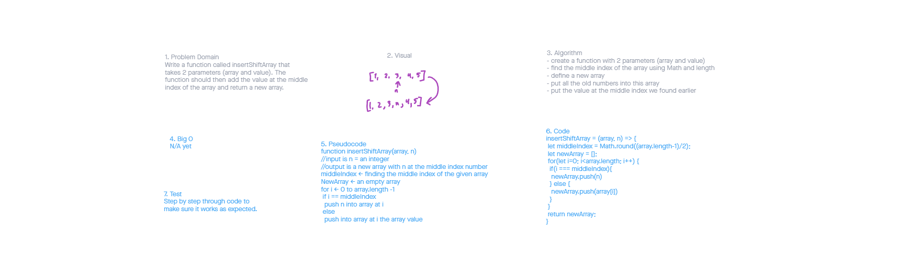

# Insert to Middle of an Array
Write a function called insertShiftArray which takes in an array and a value to be added. Without utilizing any of the built-in methods available to your language, return an array with the new value added at the middle index.

## Whiteboard Process

## Approach & Efficiency

I tried to follow the concepts of 'thinking like a programmer' that was outlined in some of our readings. This entailed following the witeboard apporach of taking things one step at a time and not jumping right into the code. This problem was relatively simple, to the solution was relatively short. 